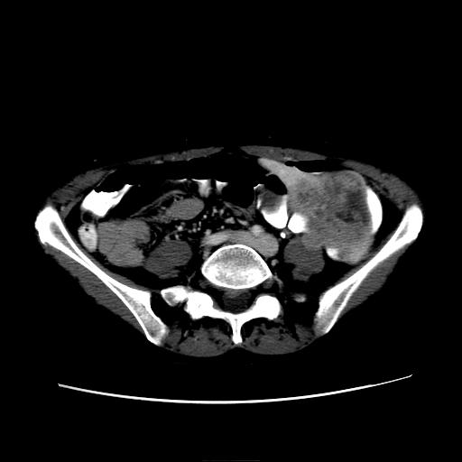
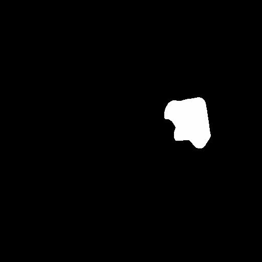
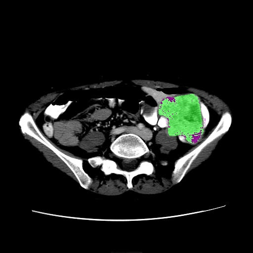
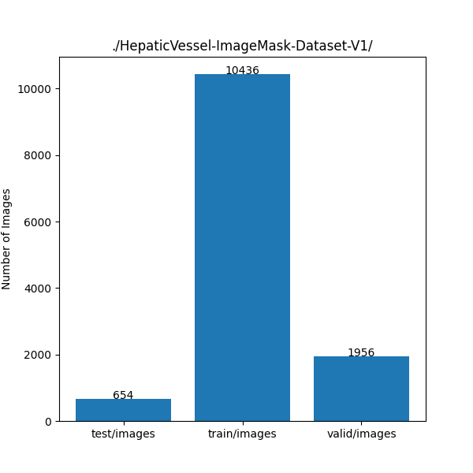
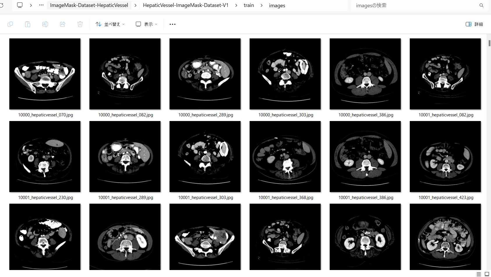
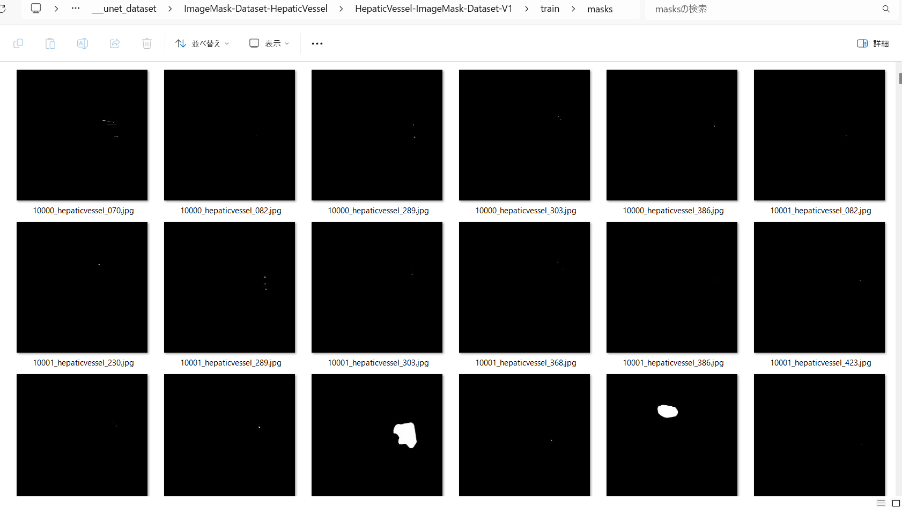
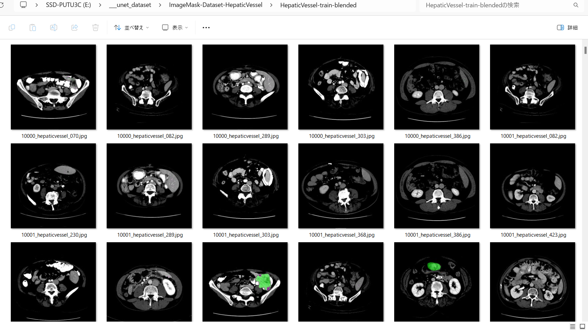

<h2>ImageMask-Dataset-HepaticVessel (2024/05/18)</h2>
This is a HepaticVessel ImageMask Dataset for Image Segmentation.   
 

<b>Image and mask sample</b> 

<table>
<tr>
<th>
Image 
</th>
<th>
Mask
</th>
<th>
Image+Mask
</th>

</tr>

<td>

</td>
<td>

</td>
<td>

</td>

</table>
 
<b>Download HepaticVessel-ImageMask-Dataset </b> 
You can download the latest dataset from the google drive 
<a href="https://drive.google.com/file/d/1pjZPc5Wu1QSSC_EYmfnNfEqBovfbNmxt/view?usp=sharing">
HepaticVessel-ImageMask-Dataset-V1.zip
</a> 

<h3>1. Dataset Citatioin</h3>

The image dataset used here has been taken from the google drive. 
<a href="https://drive.google.com/file/d/1qVrpV7vmhIsUxFiH189LmAn0ALbAPrgS/view?usp=drive_link">Task08_HepaticVessel.tar</a>
uploaded by 
<a href="http://medicaldecathlon.com/">Medical Segmentation Decathlon</a>
 
 
On Medical Segmentation Decathlon, please refer to 
<a href="https://www.nature.com/articles/s41467-022-30695-9">The Medical Segmentation Decathlon</a>
 
 
<b>About Dataset</b>
<pre>
{ 
"name": "HepaticVessel", 
"description": "Hepatic Vessels and Tumour Segmentation",
"reference": "Memorial Sloan Kettering Cancer Center",
"licence":"CC-BY-SA 4.0",
"release":"1.1 14/08/2018",
"tensorImageSize": "3D",
"modality": { 
   "0": "CT"
 }, 
 "labels": { 
   "0": "background", 
   "1": "Vessel", 
   "2": "Tumour"
 }, 
 "numTraining": 303, 
 "numTest": 140,
}
...
</pre>
<a href="./dataset.json">dataset.json</a>
 

<h3>
2. Download master dataset
</h3>
Please download the master dataset from the following link 
<a href="https://drive.google.com/file/d/1qVrpV7vmhIsUxFiH189LmAn0ALbAPrgS/view?usp=drive_link">Task08_HepaticVessel.tar</a>

The dataset has the following folder structure. 
<pre>
./Task08_HepaticVessel
 ├─imagesTr
 ├─imagesTs
 └─labelsTr
</pre>
The <b>imagesTr</b> folder contains spleen*.nii.gz, and <b>labelsTr</b>hepaticvessel_*.nii.gz file for training.The <b>imagesTs</b> contains 
hepaticvessel_*.nii.gz files for testing.  

Please note that we use <b>imagesTr</b> and <b>labelsTr</b> folders only, because <b>imagesTs</b> has no correspoingn labels (mask) to <b>imagesTs</b>. 
<h3>
3. Create ImageMask Dataset
</h3>
<h3>
3.1 Create master dataset
</h3>
Please run Python script <a href="./ImageMaskDatasetGenerator.py">ImageMaskDatasetGenerator.py</a>.
to create jpg image and mask files. 
<pre>
>python ImageMaskDatasetGenerator.py
</pre>
This script performs the following image processings. 
<pre>
1 Create 512x512 square masks from the spleen*.nii.gz files in labelsTr.
2 Create 512x512 square images corresponding to the mask files from the spleen*.nii.gz files in imagesTr folder.
</pre>
The created </HepaticVessel-master</b> dataset has the following folder structure. 

<pre>
./HepaticVessel-master
  └─train
      ├─images
      └─masks
</pre>

<h3>
3.2 Split master dataset to test, train and valid 
</h3>
By using Python script <a href="./split_master.py">split_master.py</a>,
 we have finally created <b>HepaticVessel-ImageMask-Dataset</b> dataset from the <b>HepaticVessel-master</b>. 
<pre>
./HepaticVessel-ImageMask-Dataset
├─test
│  ├─images
│  └─masks
├─train
│  ├─images
│  └─masks
└─valid
    ├─images
    └─masks
</pre>

<b>HepaticVessel-ImageMask-Dataset staticstic</b>
 
 

 
<b>train/images samples:</b> 

 
<b>train/masks samples:</b> 

 
<b>train image + masks sample:</b> 

 

